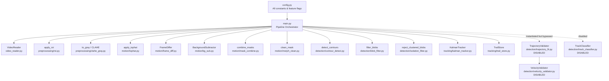
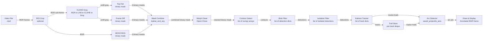
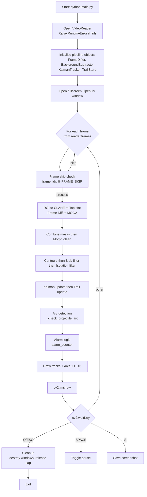
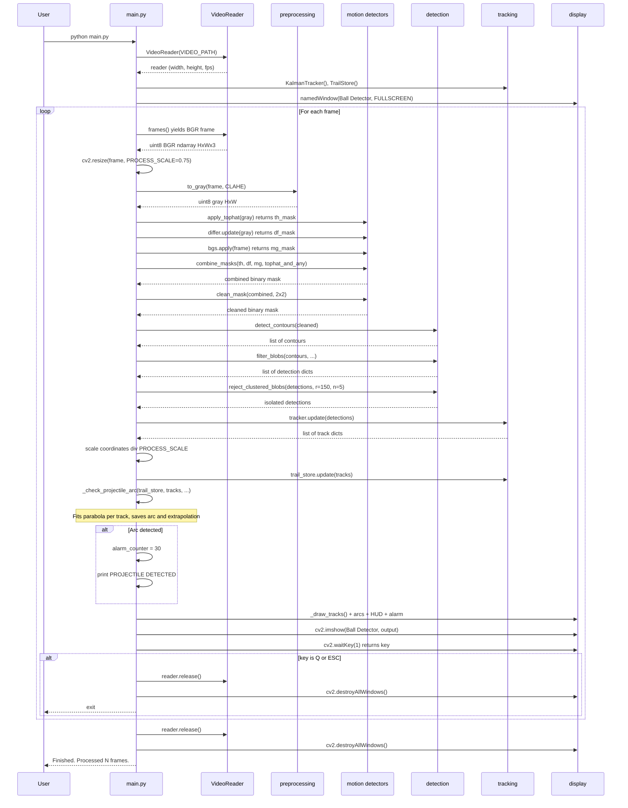

# CODEBASE_ARCHITECTURE.md
# Projectile Detection using Video Analysis — Canonical Architectural Reference

> **Document status:** Generated from full source-code inspection of `march_ver/` branch.  
> **Last updated:** 2026-09-26  
> **Version:** 1.0 — Initial documentation pass.

---

## Table of Contents

1. [Project Overview](#1-project-overview)
2. [Repository Structure](#2-repository-structure)
3. [System Architecture](#3-system-architecture)
4. [Detailed Module Documentation](#4-detailed-module-documentation)
5. [Object Detection Pipeline](#5-object-detection-pipeline)
6. [Data Structures and Data Contracts](#6-data-structures-and-data-contracts)
7. [Configuration and Constants](#7-configuration-and-constants)
8. [External Dependencies](#8-external-dependencies)
9. [Runtime / Execution Model](#9-runtime--execution-model)
10. [Hardware / Input Interface](#10-hardware--input-interface)
11. [Error Handling and Edge Cases](#11-error-handling-and-edge-cases)
12. [Performance Characteristics](#12-performance-characteristics)
13. [Current Limitations](#13-current-limitations)
14. [C++ Migration-Relevant Architecture](#14-c-migration-relevant-architecture)
15. [Dependency Graph](#15-dependency-graph)
16. [Execution Sequence](#16-execution-sequence)
17. [Important Algorithms](#17-important-algorithms)
18. [Current State / Source of Truth](#18-current-state--source-of-truth)
19. [Change-Safety Map](#19-change-safety-map)
20. [AI Development Rules](#20-ai-development-rules)

---

## 1. Project Overview

### Purpose
Detect, track, and classify a small high-speed projectile (tennis ball) in outdoor video footage, draw its trajectory arc, predict its landing point, and trigger a visual alarm on detection.

### Problem Being Solved
A tennis ball at 50 m distance subtends only **2–8 pixels** on the sensor. The background includes dynamic elements (clouds, foliage, people) that produce a high false-positive rate in naive motion detectors. The system combines multiple complementary motion-detection filters, shape-based blob rejection, Hungarian-matched Kalman tracking, and parabolic-trajectory fitting to isolate the ball from all background noise.

### Current Processing Mode
**Video-file-based** (offline). The input is a pre-recorded `.mp4` file. No webcam, no live-stream, no camera device interface. The path is hardcoded as `VIDEO_PATH` in `config.py`.

### Major Technologies / Libraries
- **OpenCV 4.13** — all image processing, video I/O, Kalman filter, morphological operations, display.
- **NumPy 2.4** — array math, polyfit, matrix operations.
- **SciPy 1.17** — Hungarian assignment (`scipy.optimize.linear_sum_assignment`). Optional: `scipy.spatial.cKDTree` for isolation filter fast-path.
- **Python 3.12+** — union-type hints (`X | Y`), `collections.deque`, `typing`.

### Current Input and Output

| Aspect | Detail |
|---|---|
| Input | Single video file (.mp4), path set in `config.py` |
| Output | Annotated video stream displayed in a fullscreen OpenCV window |
| Secondary output | Terminal log of detections and frame count; optional screenshot PNGs |
| No file output | The system does NOT write video files, CSVs, or logs to disk (except screenshots) |

### High-Level Execution Flow
```
Open video file
  → For each frame:
      ROI crop (optional)
      → CLAHE grayscale
      → Top-hat spatial filter
      → 3-frame temporal difference
      → MOG2 background subtraction
      → Combine motion masks
      → Morphological denoising
      → Contour detection
      → Blob shape filter (area/circularity/solidity/aspect ratio)
      → Isolation filter (reject clustered blobs)
      → Kalman tracking (predict → Hungarian match → correct)
      → Trail history recording
      → Trajectory validation (parabola fit) [DISABLED in current config]
      → Track classification [DISABLED in current config]
      → Parabolic arc detection & landing extrapolation
      → Draw output + HUD + alarm overlay
      → Display frame
      → Handle keyboard events
  → Cleanup
```

---

## 2. Repository Structure

```
Projectile-Detection-using-Video-Analysis/
│
├── CODEBASE_ARCHITECTURE.md          ← [THIS FILE] Canonical reference
│
├── assets/                           ← Test video clips (input data)
│   ├── 50m-1.mp4                     Sample video (67 MB)
│   ├── 50m-2.mp4                     Sample video (69 MB)
│   ├── 50m-3.mp4                     Sample video (14 MB)
│   └── 50m-4.mp4                     Sample video (10 MB)
│
└── march_ver/                        ← Active production codebase
    │
    ├── main.py                       ← ENTRY POINT. Full pipeline orchestrator (968 lines)
    ├── config.py                     ← Single source of truth for all parameters
    ├── video_reader.py               ← VideoReader class wrapping cv2.VideoCapture
    │
    ├── preprocessing/                ← Frame preparation before motion detection
    │   ├── __init__.py               Empty (namespace package)
    │   ├── roi.py                    Region-of-interest crop
    │   └── clahe_gray.py             CLAHE contrast enhancement + BGR→gray conversion
    │
    ├── motion/                       ← Motion detection — three parallel detector layers
    │   ├── __init__.py               Empty
    │   ├── tophat.py                 Morphological top-hat spatial filter → binary mask
    │   ├── frame_diff.py             3-frame temporal difference → binary mask
    │   ├── bg_sub.py                 MOG2 background subtraction → binary mask
    │   ├── mask_combine.py           Merges up to three binary masks using configurable strategy
    │   └── morph_clean.py            Morphological denoising of the combined mask
    │
    ├── detection/                    ← Object identification from the cleaned mask
    │   ├── __init__.py               Empty
    │   ├── contour_detect.py         cv2.findContours wrapper with area pre-filter
    │   ├── blob_filter.py            Geometric filter: area, aspect ratio, circularity, solidity
    │   ├── isolation_filter.py       Cluster rejection: real ball is always isolated
    │   ├── trajectory_fit.py         TrajectoryValidator — per-track parabola fitter [DISABLED]
    │   ├── velocity_validator.py     VelocityValidator — dx variance & dy linearity checks [DISABLED]
    │   └── track_classifier.py       TrackClassifier — multi-heuristic projectile vs noise [DISABLED]
    │
    ├── tracking/                     ← Multi-object state tracking over time
    │   ├── __init__.py               Empty
    │   ├── kalman_tracker.py         KalmanTracker — Kalman filters + Hungarian assignment
    │   └── trail_store.py            TrailStore — per-track position history (deque)
    │
    ├── _patch2.py                    ← [DEPRECATED] One-shot migration script. Already applied.
    └── tempCodeRunnerFile.py         ← [GENERATED/GARBAGE] VS Code temp artifact. Empty.
```

### Component Roles

| File | Role | Category |
|---|---|---|
| `main.py` | Pipeline orchestrator, rendering, keyboard I/O | **Core — critical** |
| `config.py` | All tunable constants and feature flags | **Core — critical** |
| `video_reader.py` | Video file abstraction | **Core** |
| `preprocessing/roi.py` | Optional frame crop | **Core** |
| `preprocessing/clahe_gray.py` | Contrast enhancement + grayscale | **Core** |
| `motion/tophat.py` | Spatial filter for tiny bright/dark blobs | **Core** |
| `motion/frame_diff.py` | 3-frame temporal motion detection | **Core** |
| `motion/bg_sub.py` | MOG2 statistical background model | **Core** |
| `motion/mask_combine.py` | Multi-mask fusion strategy | **Core** |
| `motion/morph_clean.py` | Noise removal via morphological ops | **Core** |
| `detection/contour_detect.py` | Contour extraction from binary mask | **Core** |
| `detection/blob_filter.py` | Shape-based blob rejection | **Core** |
| `detection/isolation_filter.py` | Cluster-based false-positive rejection | **Core** |
| `detection/trajectory_fit.py` | Parabola fitting per track | **Configured-but-disabled** |
| `detection/velocity_validator.py` | Velocity consistency checks | **Configured-but-disabled** |
| `detection/track_classifier.py` | High-level projectile classification | **Configured-but-disabled** |
| `tracking/kalman_tracker.py` | Kalman + Hungarian multi-object tracker | **Core** |
| `tracking/trail_store.py` | Position history per track | **Core** |
| `assets/*.mp4` | Test footage | **Data** |
| `_patch2.py` | Historical migration script (already applied) | **Deprecated — do not run** |
| `tempCodeRunnerFile.py` | VS Code artifact | **Generated/garbage** |

---

## 3. System Architecture

### 3.1 Major Components



### 3.2 Data-Flow Diagram



### 3.3 Main Execution Flow



---

## 4. Detailed Module Documentation

### 4.1 `main.py` — Pipeline Orchestrator

**Path:** `march_ver/main.py` (968 lines)  
**Role:** Imports and wires every other module. Runs the main loop.

#### Module-Level Constants

| Name | Value | Purpose |
|---|---|---|
| `TRACK_COLORS` | 8-element BGR tuple list | Cycling colour palette for track IDs |
| `COLOR_PROJECTILE_ARC` | `(92, 230, 92)` | Green arc drawn for confirmed parabolic flight |
| `COLOR_EXTRAPOLATION` | `(44, 44, 255)` | Red extrapolated landing path |
| `FINAL_WINDOW_TITLE` | `"Ball Detector"` | Main display window name |
| `TRACKING_ACTIVE` | `bool` | `ENABLE_KALMAN and not TEMP_DISABLE_TRACKING` |
| `TRAJECTORY_ACTIVE` | `bool` | `ENABLE_TRAJECTORY and TRACKING_ACTIVE` |
| `TRAIL_ACTIVE` | `bool` | `ENABLE_TRAIL and TRACKING_ACTIVE` |
| `CLASSIFIER_ACTIVE` | `bool` | `ENABLE_CLASSIFIER and TRACKING_ACTIVE` |
| `ALARM_HOLD_FRAMES` | `30` | Frames alarm remains visible after last projectile |
| `DEBUG_WINDOWS` | `list[str]` | 11 named debug window titles |

#### Helper Functions

| Function | Signature | Purpose |
|---|---|---|
| `_resize_for_display` | `(frame) -> frame` | Downscale to `DISPLAY_MAX_W x DISPLAY_MAX_H` if needed |
| `_show_debug_masks` | `(masks: dict)` | Opens named windows for enabled debug mask views |
| `_wants_filter_layer_debug` | `() -> bool` | Returns `True` if any per-layer filter debug flag is on |
| `_filter_blobs_with_layers` | `(contours) -> (detections, layers)` | Inline re-implementation of blob filtering that also records which contours survived each filter stage (used only when debug is on) |
| `_select_primary_projectile` | `(detections) -> list` | Picks the single best detection by scoring circularity + solidity + area proximity. Used only when `TEMP_DISABLE_TRACKING=True`. |
| `_scale_detections` | `(detections, scale) -> list` | Scales bbox/center back from processing-resolution to display-resolution |
| `_draw_projectile_detections` | `(frame, detections, color) -> frame` | Draw bounding boxes without IDs (no-tracking mode) |
| `_draw_contour_layer` | `(frame, contours, title, color) -> frame` | Debug: draw one filter-layer contour set with count label |
| `_show_filter_layers` | `(frame, layer_contours, detections)` | Debug: show per-filter-stage debug windows |
| `_draw_tracks` | `(frame, tracks, trail_store, validators, classifier, show_trail) -> frame` | Primary rendering: boxes, trails, parabola arcs, classification-aware colouring |
| `_draw_hud` | `(frame, frame_idx, n_tracks, n_dets, n_projectiles, warmed_up) -> frame` | HUD overlay: frame count, track count, warm-up warning, keyboard hints |
| `_draw_alarm` | `(frame, active, fade) -> frame` | Green border flash + "PROJECTILE DETECTED" banner with fade |
| `_build_extrapolated_path` | `(coeffs, observed_pts, frame_width, frame_height) -> list[tuple]` | Forward-only parabola extrapolation to predicted landing point |
| `_check_projectile_arc` | `(trail_store, tracks, frame_width, frame_height) -> (flagged_ids, arcs, extrapolations)` | Per-track parabola fit; returns IDs, fitted arc points, extrapolated path |

#### `main()` Function — State Variables

| Variable | Type | Purpose |
|---|---|---|
| `reader` | `VideoReader` | Video file handle |
| `differ` | `FrameDiffer` | 3-frame diff stateful buffer |
| `bgs` | `BackgroundSubtractor` | MOG2 stateful model |
| `tracker` | `KalmanTracker or None` | Multi-object Kalman tracker |
| `trail_store` | `TrailStore` | Position history per track |
| `classifier` | `TrackClassifier or None` | `None` (CLASSIFIER disabled) |
| `validators` | `dict[int, TrajectoryValidator]` | Empty dict (TRAJECTORY disabled) |
| `saved_projectile_arcs` | `dict[int, list[tuple]]` | Permanently accumulated fitted arcs keyed by track ID |
| `saved_projectile_predictions` | `dict[int, list[tuple]]` | Permanently accumulated extrapolated landing paths |
| `alarm_counter` | `int` | Countdown frames for alarm visibility |
| `paused` | `bool` | Pause state |
| `debug_on` | `bool` | Toggles debug mask windows (currently never enabled at runtime — see note) |

> **[UNCERTAIN]** `debug_on` starts as `False` and the 'D' key handler prints a message saying debug windows are disabled rather than toggling it. Debug windows controlled via config-level `DEBUG_SHOW_*` flags are shown only when `debug_on` is `True`, which is never set. The config-level `ENABLE_DEBUG_VIEW = True` is not directly used to control `debug_on` in the main loop. Effectively, debug mask windows are permanently off during normal operation even if `ENABLE_DEBUG_VIEW` is `True`.

---

### 4.2 `config.py` — Central Configuration

**Path:** `march_ver/config.py` (341 lines)  
**Role:** Single file containing every tunable constant. All other files import from it. Has a `__main__` self-test that prints and validates all values.

**Import:** `import cv2` — needed only for `FONT_FACE = cv2.FONT_HERSHEY_SIMPLEX`.

See [Section 7](#7-configuration-and-constants) for exhaustive parameter table.

---

### 4.3 `video_reader.py` — Video I/O Abstraction

**Path:** `march_ver/video_reader.py`  
**Class:** `VideoReader`

#### Class: `VideoReader`

| Member | Type | Purpose |
|---|---|---|
| `path` | `str` | Stored video path |
| `cap` | `cv2.VideoCapture` | Underlying capture object |
| `width` | `@property int` | Frame width in pixels |
| `height` | `@property int` | Frame height in pixels |
| `fps` | `@property float` | Source FPS from codec metadata |
| `frame_count` | `@property int` | Total frame count from metadata |
| `duration_seconds` | `@property float` | Computed `frame_count / fps` |

#### Methods

| Method | Returns | Behaviour |
|---|---|---|
| `__init__(path)` | — | Opens capture; raises `RuntimeError` if `isOpened()` fails |
| `read()` | `(bool, ndarray or None)` | Single frame read |
| `frames()` | `Generator[ndarray]` | Yields BGR frames until video ends |
| `seek(frame_index)` | — | `CAP_PROP_POS_FRAMES` seek |
| `release()` | — | Releases capture |

**Note:** `VideoReader` does **not** implement `__del__`; `release()` must be called explicitly. `main.py` calls it in cleanup and on early exits.

---

### 4.4 `preprocessing/roi.py` — Region of Interest

**Path:** `march_ver/preprocessing/roi.py`

#### Constants in file (not imported from config)
```python
X = 0.467   # Default anchor_x — slightly left of centre
Y = 0.5
```
These shadow `ROI_ANCHOR_X` and `ROI_ANCHOR_Y` from `config.py` only within the function default arguments. `main.py` passes the config values explicitly.

#### Functions

| Function | Inputs | Outputs | Behaviour |
|---|---|---|---|
| `apply_roi(frame, percent, anchor_x, anchor_y)` | BGR ndarray, float, float, float | `(cropped_frame, (ox, oy))` | Crops a rectangle of size `(W*percent x H*percent)` centred at `(W*anchor_x, H*anchor_y)`. Clamps to frame bounds. Returns crop and pixel offset. |
| `draw_roi_on_frame(frame, percent, anchor_x, anchor_y)` | BGR ndarray, floats | BGR ndarray | Debug visualiser: dims outside-ROI pixels, draws green rectangle. NOT called by `main.py`. |

**Current config:** `ENABLE_ROI = False`. ROI is not applied; `main.py` sets `roi_frame = frame, offset = (0, 0)` in the else branch.

---

### 4.5 `preprocessing/clahe_gray.py` — Contrast Enhancement

**Path:** `march_ver/preprocessing/clahe_gray.py`

#### Function: `to_gray(frame, clahe_clip, clahe_tile, use_clahe)`

| Input | Type | Description |
|---|---|---|
| `frame` | `uint8 BGR ndarray` | Input frame |
| `clahe_clip` | `float` | Clip limit (default 3.0) |
| `clahe_tile` | `tuple` | Grid size (default `(8,8)`) |
| `use_clahe` | `bool` | If `False`, returns plain `cv2.COLOR_BGR2GRAY` |

**Output:** Single-channel `uint8` grayscale ndarray, same width/height as input.

**Algorithm (when `use_clahe=True`):**
1. BGR -> LAB (`cv2.COLOR_BGR2LAB`)
2. Split L, a, b channels
3. Apply CLAHE to L channel only
4. Merge enhanced L with original a, b
5. LAB -> BGR -> Gray

**Side effect:** Creates a new `cv2.createCLAHE` object on **every call**. This is a performance concern (see Section 12).

---

### 4.6 `motion/tophat.py` — Top-Hat Spatial Filter

**Path:** `march_ver/motion/tophat.py`

#### Function: `apply_tophat(gray, kernel_size, threshold, mode)`

| Input | Type | Description |
|---|---|---|
| `gray` | `uint8 single-channel ndarray` | CLAHE-enhanced grayscale |
| `kernel_size` | `tuple` | Elliptical structuring element size (config: `(11,11)`) |
| `threshold` | `int` | Binary threshold applied post-filter (config: `12`) |
| `mode` | `str` | `"white"`, `"black"`, or `"both"` (config: `"both"`) |

**Output:** `uint8` binary mask (0 or 255).

**Algorithm:**
- `"white"`: `MORPH_TOPHAT` — extracts bright features smaller than kernel
- `"black"`: `MORPH_BLACKHAT` — extracts dark features smaller than kernel  
- `"both"`: `cv2.max(white, black)` — captures ball regardless of luminance relationship to background

---

### 4.7 `motion/frame_diff.py` — Temporal Differencing

**Path:** `march_ver/motion/frame_diff.py`

#### Class: `FrameDiffer`

| Member | Type | Purpose |
|---|---|---|
| `gap` | `int` | Temporal spacing between compared frames |
| `threshold` | `int` | Intensity diff threshold |
| `_buffer` | `deque(maxlen=2*gap+1)` | Rolling grayscale frame buffer |

#### Method: `update(gray) -> ndarray or None`

Returns `None` for the first `2*gap` frames (buffer not yet full).

**Algorithm (3-frame difference):**
```
diff1 = |frame[t] - frame[t-gap]|
diff2 = |frame[t-gap] - frame[t-2*gap]|
mask1 = threshold(diff1)
mask2 = threshold(diff2)
result = mask1 AND mask2
```
Only pixels that changed in **both** intervals survive — the moving object. Static edges and sensor noise are eliminated.

**Method: `reset()`** — Clears buffer. Called in self-tests when seeking backward.

---

### 4.8 `motion/bg_sub.py` — Background Subtraction

**Path:** `march_ver/motion/bg_sub.py`

#### Class: `BackgroundSubtractor` (alias: `BgSubtractor`)

| Member | Type | Purpose |
|---|---|---|
| `mog2` | `cv2.BackgroundSubtractorMOG2` | OpenCV background model |
| `_frame_count` | `int` | Frames processed (for warm-up detection) |
| `is_warmed_up` | `@property bool` | `True` once `_frame_count >= _history` |

#### Method: `apply(frame) -> ndarray`

Accepts BGR or grayscale. Converts to gray internally. Forces binary output — MOG2 shadow pixels (value 127) are thresholded out at 200.

#### Method: `reset()`

Re-creates the MOG2 object from scratch, resetting the background model.

> **[UNCERTAIN]** The `apply()` method receives `roi_frame` (the BGR frame), not the CLAHE-enhanced grayscale. It converts internally to gray via `cv2.COLOR_BGR2GRAY` (plain conversion, no CLAHE). This is inconsistent with `frame_diff` and `tophat` which receive the CLAHE-enhanced gray. This means MOG2 operates on a slightly different grayscale representation than the other two detectors.

---

### 4.9 `motion/mask_combine.py` — Mask Fusion

**Path:** `march_ver/motion/mask_combine.py`

#### Function: `combine_masks(tophat_mask, fdiff_mask, mog2_mask, mode)`

**Active mode (config): `"tophat_and_any"`**

```python
temporal = fdiff OR mog2
result   = tophat AND temporal
```

This requires a pixel to:
1. Be small enough to pass the top-hat spatial filter (spatial evidence)
2. Have also moved in at least one temporal detector (motion evidence)

**Other modes available (not currently active):** `"or"`, `"and"`, `"motion_primary"`

Handles `None` inputs (disabled detectors) gracefully by substituting a zero mask.

---

### 4.10 `motion/morph_clean.py` — Morphological Denoising

**Path:** `march_ver/motion/morph_clean.py`  
**Aliases:** `morph_clean` (function name), `clean_mask` (alias, used by `main.py`)

#### Function: `morph_clean(mask, kernel_size) -> ndarray`

**Algorithm:**
1. OPEN (erode then dilate): removes isolated noise pixels
2. CLOSE (dilate then erode): fills small holes inside blobs

**Kernel:** Rectangular (`MORPH_RECT`), size `(2,2)` — minimal, preserving 2–5 px ball.

---

### 4.11 `detection/contour_detect.py` — Contour Extraction

**Path:** `march_ver/detection/contour_detect.py`

#### Function: `detect_contours(mask, min_area_prefilter=1.5) -> list[ndarray]`

Calls `cv2.findContours(mask, RETR_EXTERNAL, CHAIN_APPROX_SIMPLE)`.  
Pre-filters: drops contours with area < 1.5 px squared (single-pixel hits) before passing to blob filter.

**Output:** List of `ndarray` contour arrays (dtype int32, shape `(N, 1, 2)` in OpenCV format).

---

### 4.12 `detection/blob_filter.py` — Shape-Based Filtering

**Path:** `march_ver/detection/blob_filter.py`

#### Function: `filter_blobs(contours, min_area, max_area, min_circularity, min_solidity, max_aspect_ratio) -> list[dict]`

**Filter pipeline (cheapest-first):**

| Step | Metric | Formula | Config value |
|---|---|---|---|
| 1 | Area | `cv2.contourArea(cnt)` | 2 – 80 px squared |
| 2 | Aspect ratio | `max(w,h) / min(w,h)` | <= 3.0 |
| 3 | Circularity | `4*pi*area / perimeter^2` | >= 0.6 |
| 4 | Solidity | `area / convex_hull_area` | >= 0.6 |

**Output dict per blob:**
```python
{
    "bbox"         : (x, y, w, h),     # bounding rect
    "center"       : (cx, cy),          # bbox midpoint
    "area"         : float,             # px squared
    "circularity"  : float,             # 0.0-1.0
    "solidity"     : float,             # 0.0-1.0
    "aspect_ratio" : float,             # >= 1.0
}
```

**Also exists in `main.py`:** `_filter_blobs_with_layers()` — an inline re-implementation that additionally records which contours pass each stage. Used only when debug windows are enabled.

---

### 4.13 `detection/isolation_filter.py` — Cluster Rejection

**Path:** `march_ver/detection/isolation_filter.py`

#### Function: `reject_clustered_blobs(detections, radius, min_cluster_size, return_debug) -> list[dict]`

**Algorithm:**
1. For each detection, count neighbours within `radius` pixels (Euclidean distance on centres).
2. If any detection has `neighbour_count >= min_cluster_size`, mark it AND all its neighbours for rejection.
3. Return only unmarked (isolated) detections.

**Config values:** `ISOLATION_RADIUS = 150`, `ISOLATION_MIN_CLUSTER = 5`

**Performance:** O(n squared) for n <= 200 detections; uses `scipy.spatial.cKDTree` fast-path for n > 200 if scipy is available.

**Physical assumption:** A real ball in flight is always a single isolated blob; noise sources (leaves, grass) produce tight clusters.

---

### 4.14 `detection/trajectory_fit.py` — Parabola Trajectory Validator

**Path:** `march_ver/detection/trajectory_fit.py`  
**Status:** [DISABLED] — `ENABLE_TRAJECTORY = False` in current config.

#### Class: `TrajectoryValidator`

| Member | Type | Purpose |
|---|---|---|
| `min_points` | `int` | Minimum history before fitting (config: 5) |
| `max_residual` | `float` | Max mean pixel error for valid fit (config: 50.0) |
| `_history` | `deque(maxlen=max(min_points*3,20))` | Rolling (cx,cy) positions |
| `_coeffs` | `ndarray[3] or None` | Fitted `[a, b, c]` from `np.polyfit(deg=2)` |
| `_residual` | `float or None` | Current mean absolute residual |
| `_vel_validator` | `VelocityValidator` | Velocity profile sub-check |

**Method: `update(cx, cy)`** — Adds point, calls `_fit()`.

**Method: `is_valid()`** — Returns `True` if residual <= max_residual AND velocity profile valid AND shape descriptors pass.

**Method: `get_fitted_points(n=50)`** — Returns 50 points along fitted parabola for drawing.

Shape descriptor checks (configurable thresholds in config but currently disabled via parent flag):
- `arc_ratio`: vertical span / horizontal span <= `TRAJECTORY_MAX_ARC_RATIO` (2.5)
- `apex_count`: local y-minima <= `TRAJECTORY_MAX_APEX_COUNT` (5)
- `speed_jitter`: variance of frame-to-frame speed <= `TRAJECTORY_MAX_SPEED_JITTER` (90.0)

---

### 4.15 `detection/velocity_validator.py` — Velocity Profile Analysis

**Path:** `march_ver/detection/velocity_validator.py`  
**Status:** [DISABLED] — only instantiated inside `TrajectoryValidator` which is itself disabled.

#### Class: `VelocityValidator`

Checks three conditions on the rolling centroid history:
1. **Horizontal velocity variance** (dx per frame) <= `VELOCITY_DX_MAX_VARIANCE` (100.0)
2. **Horizontal direction flips** <= `VELOCITY_MAX_DIRECTION_FLIPS` (1)
3. **Vertical displacement linearity**: R-squared of linear fit to cumulative dy vs. time >= `VELOCITY_DY_MIN_R2` (0.1)

These thresholds in the current config are deliberately loose (near-permissive), suggesting the feature is not yet tuned.

---

### 4.16 `detection/track_classifier.py` — Multi-Heuristic Track Classifier

**Path:** `march_ver/detection/track_classifier.py`  
**Status:** [DISABLED] — `ENABLE_CLASSIFIER = 0` in current config.

#### Class: `TrackClassifier`

Classifies each track as `"projectile"`, `"noise"`, or `"pending"`.

**Labels:**
- `"pending"` — track not yet old enough for classification
- `"noise"` — failed one or more checks
- `"projectile"` — passed all checks; once set, remains `"projectile"` permanently

**Classification checks (in order):**
1. Net displacement >= `CLASSIFIER_MIN_DISPLACEMENT` (20 px)
2. Speed in range [5.0, 100.0] px/frame
3. Path efficiency = net_disp / total_path >= 0.3
4. Spatial spread (max bounding-box span) >= 35 px
5. Consistent motion direction >= 70% of steps
6. Clean-arc fast-track: if path efficiency >= 0.8 AND parabola residual < 15 px AND net displacement > 100 px, immediately return `"projectile"`
7. Trajectory validator is_valid() (if available)

**State:**
- `_labels: dict[int, str]` — current classifications
- `_first_position: dict[int, tuple]` — first observed centre per track

---

### 4.17 `tracking/kalman_tracker.py` — Multi-Object Kalman Tracker

**Path:** `march_ver/tracking/kalman_tracker.py`

#### Class: `_Track` (internal)

One instance per tracked object. Contains its own `cv2.KalmanFilter`.

**Kalman state model:**
- State vector: `[x, y, vx, vy]` (4D)
- Measurement: `[x, y]` (2D)
- Transition: constant-velocity (`x' = x + vx`, `y' = y + vy`)
- Optional gravity control input (`KALMAN_USE_GRAVITY = False` in current config — not active)

**Key fields:**

| Field | Purpose |
|---|---|
| `id` | Globally unique, monotonically increasing integer |
| `age` | Total frames this track has existed |
| `missing` | Consecutive frames without a matched detection |
| `predicted` | `True` if current position is from Kalman prediction only |
| `last_detection` | Last blob filter dict (contains bbox) |
| `innovation` | Distance between prediction and matched detection centre |

**`to_dict()` output:**
```python
{
    "id"       : int,
    "center"   : (cx, cy),
    "bbox"     : (x, y, w, h),   # from last_detection, or 8x8 fallback
    "velocity" : (vx, vy),
    "speed"    : float,           # px/frame
    "missing"  : int,
    "age"      : int,
    "predicted": bool,
    "det"      : dict or None,    # last detection dict
    "innovation": float,
    "suspect_innovation": bool,
}
```

#### Class: `KalmanTracker`

**`update(detections) -> list[dict]`** — Core method. Three-phase per frame:

1. **Predict:** Call `track.predict()` on every existing track.
2. **Associate:** Build O(n*m) cost matrix (Euclidean distance). Solve with `scipy.optimize.linear_sum_assignment`. Accept pairs where distance <= `KALMAN_MAX_DISTANCE` (80 px).
3. **Update:** Matched tracks -> `correct()`; unmatched tracks -> increment `missing`; unmatched detections -> spawn new `_Track`.

Prune: Remove tracks where `missing > KALMAN_MAX_MISSING` (6).

**Class-level state:** `_Track._next_id` is a class variable — monotonically increasing. `KalmanTracker.reset()` sets it back to 0.

---

### 4.18 `tracking/trail_store.py` — Position History Store

**Path:** `march_ver/tracking/trail_store.py`

#### Class: `TrailStore`

| Member | Type | Purpose |
|---|---|---|
| `max_length` | `int` | Max positions kept per track |
| `_trails` | `dict[int, deque]` | Per-track deque of `(cx, cy, observed)` tuples |

**`update(tracks_or_id, ...)` — [CONTAINS SYNTAX/RUNTIME BUG]**

The `update()` method has an unquoted comment on line 45 of the source file:
```python
if isinstance(tracks_or_id, list):
    main.py style: list of track dicts   # <- THIS IS A BARE EXPRESSION, not a comment
```
This is a bare expression that will raise a `SyntaxError` or `NameError` at runtime on the list-dispatch branch.

> **[IMPORTANT BUG]** `main.py` calls `trail_store.update(tracks)` passing a list of track dicts (when `TRAIL_ACTIVE = True`), but the `update()` method's list branch is broken. The trail recording path crashes. The self-test in `trail_store.py` avoids this by calling `update_single()` directly.

**Correct methods to use:**
- `update_single(track_id, cx, cy, observed)` — works correctly
- `get(track_id)` -> `deque or None` — full trail with observed flags
- `get_points(track_id)` -> `list[(cx, cy)]` — positions only
- `get_observed_points(track_id)` -> `list[(cx, cy)]` — only real detections
- `draw_all_trails(frame, colors)` — renders all trails with per-track palette colours
- `draw_trails(frame, ...)` — renders with uniform observed/predicted colours
- `prune(active_ids)` — removes trails for dead tracks

---

### 4.19 `_patch2.py` — Historical Migration Script

**Path:** `march_ver/_patch2.py`  
**Status:** [DEPRECATED] — One-shot script that was run to update `main.py` from an older version. Already applied. **Do not run again.**

Performs string replacements in `main.py` to upgrade `_check_projectile_arc` to return arcs and predictions alongside IDs, add `saved_projectile_arcs` initialization, and update draw section to render permanent arcs.

The current `main.py` already reflects these changes.

---

### 4.20 `tempCodeRunnerFile.py` — IDE Artifact

**Path:** `march_ver/tempCodeRunnerFile.py`  
**Status:** [GENERATED/GARBAGE]  
Contains a single import statement left by VS Code's Python runner. Has no functional purpose.

---

## 5. Object Detection Pipeline

The pipeline is executed every frame inside `main()`. Each stage is independently gated by an `ENABLE_` flag.

### Stage 1: Frame Acquisition
- **File:** `video_reader.py` -> `VideoReader.frames()`
- **Input:** Video file at `VIDEO_PATH`
- **Output:** BGR `uint8` ndarray, shape `(H, W, 3)` — full video resolution
- **Frame skip:** `if FRAME_SKIP > 1 and (frame_idx % FRAME_SKIP) != 0: continue`
  - Current config: `FRAME_SKIP = 2` — processes every other frame

### Stage 1.5: Optional Downscale
- **Input:** Full-res BGR frame
- **Output:** Scaled BGR frame at `PROCESS_SCALE = 0.75` of original dimensions
- `display_frame = roi_frame` (full-res copy kept for drawing)
- All subsequent processing stages work on the downscaled frame

### Stage 2: CLAHE Grayscale
- **File:** `preprocessing/clahe_gray.py` -> `to_gray()`
- **Input:** BGR ndarray (possibly ROI-cropped and downscaled)
- **Output:** Single-channel `uint8` grayscale ndarray
- **Algorithm:** BGR -> LAB, enhance L with CLAHE (clip=3.0, tile=8x8), LAB -> BGR -> Gray

### Stage 3: Top-Hat Spatial Filter
- **File:** `motion/tophat.py` -> `apply_tophat()`
- **Input:** Grayscale ndarray
- **Output:** Binary mask (0/255), same shape
- **Algorithm:** Morphological top-hat + black-hat (mode="both"), elliptical kernel (11x11), threshold at 12
- **Skipped if:** `ENABLE_TOPHAT = False` -> returns `None` -> handled in mask combine

### Stage 4: 3-Frame Temporal Difference
- **File:** `motion/frame_diff.py` -> `FrameDiffer.update()`
- **Input:** Grayscale ndarray
- **Output:** Binary mask or `None` (during warmup: first 2*gap=4 frames)
- **State:** Rolling deque of `2*FRAME_DIFF_GAP+1 = 5` frames
- **Algorithm:** `AND(threshold(|f[t]-f[t-2]|), threshold(|f[t-2]-f[t-4]|))`
- **Skipped if:** `ENABLE_FRAME_DIFF = False`

### Stage 5: MOG2 Background Subtraction
- **File:** `motion/bg_sub.py` -> `BackgroundSubtractor.apply()`
- **Input:** BGR frame (NOT the CLAHE gray — see §4.8 note)
- **Output:** Binary mask (0/255)
- **State:** OpenCV MOG2 Gaussian mixture model (learns over `MOG2_HISTORY = 500` frames)
- **Warmup:** First 500 frames produce noisy output; `is_warmed_up` flag displayed in HUD
- **Skipped if:** `ENABLE_BG_SUB = False`

### Stage 6: Mask Combination
- **File:** `motion/mask_combine.py` -> `combine_masks()`
- **Input:** Three binary masks (any may be `None`)
- **Output:** Single binary mask
- **Algorithm (active):** `tophat_and_any` = `tophat AND (framediff OR mog2)`
- **Failure:** If all three are `None`, `main.py` does `continue` (skip frame)

### Stage 7: Morphological Cleaning
- **File:** `motion/morph_clean.py` -> `clean_mask()`
- **Input:** Combined binary mask
- **Output:** Cleaned binary mask
- **Algorithm:** OPEN(2x2) -> CLOSE(2x2) with rectangular kernel
- **Skipped if:** `ENABLE_MORPH_CLEAN = False` — passes combined mask through

### Stage 8: Contour Detection
- **File:** `detection/contour_detect.py` -> `detect_contours()`
- **Input:** Cleaned binary mask
- **Output:** `list[ndarray]` — contour arrays
- **Algorithm:** `cv2.findContours(RETR_EXTERNAL, CHAIN_APPROX_SIMPLE)` + area prefilter (>= 1.5 px squared)

### Stage 9: Blob Filtering
- **File:** `detection/blob_filter.py` -> `filter_blobs()`
- **Input:** Contour list
- **Output:** `list[dict]` — detection dicts with bbox, center, area, circularity, solidity, aspect_ratio
- **Filters:** area (2–80), aspect ratio (<=3.0), circularity (>=0.6), solidity (>=0.6)

### Stage 9b: Isolation Filter
- **File:** `detection/isolation_filter.py` -> `reject_clustered_blobs()`
- **Input:** Detection dicts from blob filter
- **Output:** Subset of detection dicts (isolated ones only)
- **Algorithm:** Reject any blob with >= 5 neighbours within 150 px radius
- **Physical assumption:** Ball is always alone; noise sources cluster

### Stage 10: Kalman Tracking
- **File:** `tracking/kalman_tracker.py` -> `KalmanTracker.update()`
- **Input:** List of detection dicts (centers used for association)
- **Output:** List of track dicts (see §4.17 for schema)
- **Algorithm:** Predict all tracks -> Hungarian assignment -> correct/spawn/prune
- **Skipped if:** `TRACKING_ACTIVE = False` -> `tracks = []`

### Stage 10.5: Scale Coordinate Restoration
- **Location:** `main.py` inline
- If `PROCESS_SCALE < 1.0`, multiply all track centers and bboxes by `1/PROCESS_SCALE`
- Also scales `draw_detections` for consistent bounding box positions on display frame

### Stage 11: Trail Storage
- **File:** `tracking/trail_store.py` -> `TrailStore.update()`
- **Input:** Track list
- **Output:** None (in-place update of `_trails` dict)
- **Note:** The `update(tracks)` path has a syntax bug (see §4.18). The code may crash here at runtime.

### Stage 12: Trajectory Validation
- **Status:** [DISABLED] — `TRAJECTORY_ACTIVE = False`
- `validators = {}` remains empty throughout execution.

### Stage 12.5: Track Classification
- **Status:** [DISABLED] — `classifier = None`
- Classifier block is guarded by `if classifier is not None:`.

### Arc Detection (in main loop, after stage 12.5)
- **Function:** `_check_projectile_arc(trail_store, tracks, frame_width, frame_height)`
- **Input:** All current tracks + their trail histories
- **Output:** `(flagged_ids, arcs, extrapolations)`
- **Algorithm:** For each track with >= 8 observed points:
  1. Check horizontal span >= `ARC_MIN_SPAN_RATIO * frame_width` (0.2 x width)
  2. Fit parabola: `np.polyfit(xs, ys, deg=2)` -> coefficients `[a, b, c]`
  3. Require `a > 0` (opens downward in image coords = ball arc)
  4. Require mean absolute residual <= `ARC_MAX_RESIDUAL` (15.0 px)
  5. If valid: store fitted arc + forward-extrapolated path to predicted landing

### Alarm Logic
- `n_projectiles > 0` -> sets `alarm_counter = ALARM_HOLD_FRAMES` (30)
- Prints `"[!] PROJECTILE DETECTED at frame N"` on first trigger
- Each frame alarm_counter decrements by 1 when no projectile

### Stage 13: Draw
- **Function:** `_draw_tracks()` — draws bboxes, colour-coded by classification
- Draws permanently-saved arcs (green) and extrapolated paths (red) from `saved_projectile_arcs` / `saved_projectile_predictions`
- HUD overlay: frame number, track count, detection count, MOG2 warmup warning
- Alarm overlay: green border flash + banner

### Stage 14: Display
- `cv2.imshow(FINAL_WINDOW_TITLE, output)` — fullscreen window

### Stage 15: Keyboard Handling
| Key | Action |
|---|---|
| Q / ESC | Quit |
| SPACE | Toggle pause |
| S | Save screenshot as `screenshot_NNNN.png` (CWD) |
| D | Prints "debug disabled" message — does NOT toggle debug |

---

## 6. Data Structures and Data Contracts

### 6.1 Frame (BGR Image)
- **Type:** `np.ndarray`, `dtype=uint8`, shape `(H, W, 3)`
- **Channel order:** BGR (OpenCV convention, not RGB)
- **Range:** 0–255 per channel
- **Lifecycle:** Created by `VideoReader.frames()`, flows through pipeline, consumed by display

### 6.2 Grayscale Image
- **Type:** `np.ndarray`, `dtype=uint8`, shape `(H, W)`
- Created by `to_gray()`; consumed by `apply_tophat()` and `FrameDiffer.update()`

### 6.3 Binary Mask
- **Type:** `np.ndarray`, `dtype=uint8`, shape `(H, W)`
- **Values:** Only 0 or 255
- Created by `apply_tophat()`, `FrameDiffer.update()`, `BackgroundSubtractor.apply()`, `combine_masks()`, `clean_mask()`

### 6.4 Contour Array
- **Type:** `np.ndarray`, `dtype=int32`, shape `(N, 1, 2)`
- Each point is `[[x, y]]`
- Created by `detect_contours()`; consumed by `filter_blobs()`

### 6.5 Detection Dict
```python
{
    "bbox"         : (int, int, int, int),  # (x, y, w, h) top-left + size, processing coords
    "center"       : (int, int),             # (cx, cy) bbox midpoint
    "area"         : float,                  # px squared
    "circularity"  : float,                  # 0.0-1.0
    "solidity"     : float,                  # 0.0-1.0
    "aspect_ratio" : float,                  # >= 1.0
}
```
- Created by `filter_blobs()` or by the raw-contour fallback in `main.py`
- Consumed by `reject_clustered_blobs()`, `KalmanTracker.update()`, `_scale_detections()`
- **Coordinate system:** Processing resolution (after `PROCESS_SCALE` downscaling)

### 6.6 Track Dict
```python
{
    "id"                 : int,              # globally unique, monotonically increasing
    "center"             : (int, int),       # (cx, cy) Kalman-estimated position
    "bbox"               : (int, int, int, int),  # from last_detection, or 8x8 fallback
    "velocity"           : (float, float),   # (vx, vy) px/frame
    "speed"              : float,            # |v| in px/frame
    "missing"            : int,              # consecutive frames without detection
    "age"                : int,              # total frames alive
    "predicted"          : bool,             # True if no detection this frame
    "det"                : dict or None,     # last detection dict
    "innovation"         : float,            # distance(prediction, measurement)
    "suspect_innovation" : bool,             # innovation > KALMAN_MAX_INNOVATION
}
```
- After coordinate scaling (Stage 10.5), center and bbox are in display (full-res) coordinates

### 6.7 Trail Entry (in `TrailStore._trails`)
- **Type:** `deque` of `(cx: int, cy: int, observed: bool)` tuples
- `observed = True` -> real detection; `False` -> Kalman prediction
- **Coordinate system:** Display resolution (after Stage 10.5 scaling)
- **Length:** Up to `TRAIL_LENGTH = 60`

### 6.8 Arc Points
- **Type:** `list[(int, int)]` — pixel coordinates
- `saved_projectile_arcs[tid]` — 100 points along fitted parabola over observed x-range
- `saved_projectile_predictions[tid]` — up to 100 points along forward extrapolation
- **Coordinate system:** Display resolution

### 6.9 Parabola Coefficients
- **Type:** `np.ndarray` shape `(3,)` — `[a, b, c]` from `np.polyfit(xs, ys, deg=2)`
- **Equation:** `y = a*x^2 + b*x + c` in pixel coordinates (y increases downward)
- `a > 0` -> downward-opening parabola in image coordinates (correct for a projectile arc)

### 6.10 Offset Tuple
- **Type:** `(int, int)` — `(ox, oy)` pixel offset of ROI crop
- Returned by `apply_roi()`; currently unused downstream because `ENABLE_ROI = False`

---

## 7. Configuration and Constants

All constants are defined in `march_ver/config.py`.

### Feature Flags

| Flag | Current Value | Effect when off |
|---|---|---|
| `ENABLE_ROI` | `False` | Full frame processed |
| `ENABLE_CLAHE` | `True` | Plain grayscale conversion |
| `ENABLE_TOPHAT` | `True` | `th_mask = None` |
| `ENABLE_FRAME_DIFF` | `True` | `df_mask = None` |
| `ENABLE_BG_SUB` | `True` | `mg_mask = None` |
| `ENABLE_MORPH_CLEAN` | `True` | Combined mask passed through |
| `ENABLE_BLOB_FILTER` | `True` | Raw contours used as detections |
| `ENABLE_ISOLATION_FILTER` | `True` | No cluster rejection |
| `ENABLE_TRAJECTORY` | `False` | `TrajectoryValidator` not used |
| `ENABLE_KALMAN` | `1` (truthy) | No tracking, no IDs |
| `ENABLE_TRAIL` | `1` (truthy) | No trail recording |
| `ENABLE_CLASSIFIER` | `0` (falsy) | Classifier not instantiated |
| `ENABLE_DEBUG_VIEW` | `True` | (See §4.1 note — debug_on never set) |
| `TEMP_DISABLE_TRACKING` | `False` | No effect when False |

> **[UNCERTAIN]** `ENABLE_KALMAN` and `ENABLE_TRAIL` are set to integer `1` rather than `True`. `ENABLE_CLASSIFIER` is `0` rather than `False`. This works in Python (truthy/falsy) but is inconsistent.

### Advanced Tracking Flags (all disabled)

| Flag | Value | Purpose if enabled |
|---|---|---|
| `ENABLE_VELOCITY_CHECK` | `False` | Would enable velocity checks in TrajectoryValidator |
| `ENABLE_SHAPE_DESCRIPTORS` | `False` | Would enable arc_ratio/apex_count/speed_jitter |
| `KALMAN_USE_GRAVITY` | `False` | Would add gravity control input to Kalman |

### Numeric Parameters

| Parameter | Value | Used by |
|---|---|---|
| `VIDEO_PATH` | Absolute path to .mp4 | `VideoReader`, all self-tests |
| `PROCESS_SCALE` | `0.75` | `main.py` downscale before processing |
| `FRAME_SKIP` | `2` | `main.py` skip every other frame |
| `ROI_PERCENT` | `1` (100%) | `apply_roi` when ENABLE_ROI=True |
| `ROI_ANCHOR_X` | `0.5` | `apply_roi` centre |
| `ROI_ANCHOR_Y` | `0.5` | `apply_roi` centre |
| `CLAHE_CLIP_LIMIT` | `3.0` | `to_gray` |
| `CLAHE_TILE_GRID` | `(8, 8)` | `to_gray` |
| `TOPHAT_MODE` | `"both"` | `apply_tophat` |
| `TOPHAT_KERNEL_SIZE` | `(11, 11)` | `apply_tophat` |
| `TOPHAT_THRESHOLD` | `12` | `apply_tophat` |
| `FRAME_DIFF_GAP` | `2` | `FrameDiffer` |
| `FRAME_DIFF_THRESHOLD` | `25` | `FrameDiffer` |
| `MOG2_HISTORY` | `500` | `BackgroundSubtractor` |
| `MOG2_VAR_THRESHOLD` | `40` | `BackgroundSubtractor` |
| `MOG2_DETECT_SHADOWS` | `False` | `BackgroundSubtractor` |
| `MASK_COMBINE_MODE` | `"tophat_and_any"` | `combine_masks` |
| `MORPH_KERNEL_SIZE` | `(2, 2)` | `clean_mask` |
| `MIN_BLOB_AREA` | `2` | `filter_blobs` |
| `MAX_BLOB_AREA` | `80` | `filter_blobs` |
| `MIN_CIRCULARITY` | `0.6` | `filter_blobs` |
| `MIN_SOLIDITY` | `0.6` | `filter_blobs` |
| `MAX_ASPECT_RATIO` | `3.0` | `filter_blobs` |
| `ISOLATION_RADIUS` | `150` | `reject_clustered_blobs` |
| `ISOLATION_MIN_CLUSTER` | `5` | `reject_clustered_blobs` |
| `KALMAN_MAX_DISTANCE` | `80` | `KalmanTracker` |
| `KALMAN_MAX_MISSING` | `6` | `KalmanTracker` |
| `TRAIL_LENGTH` | `60` | `TrailStore` |
| `ARC_MIN_SPAN_RATIO` | `0.2` | `_check_projectile_arc` |
| `ARC_MAX_RESIDUAL` | `15.0` | `_check_projectile_arc` |
| `ARC_MIN_POINTS` | `8` | `_check_projectile_arc` |
| `EXTRAPOLATION_STOP_FROM_BOTTOM_PX` | `400` | `_build_extrapolated_path` |
| `DISPLAY_MAX_W` | `1280` | All display/resize operations |
| `DISPLAY_MAX_H` | `720` | All display/resize operations |

### Inactive Parameters (defined in config, never consumed at runtime)

| Parameter | Value | Reason inactive |
|---|---|---|
| `VELOCITY_DX_MAX_VARIANCE` | `100.0` | `ENABLE_VELOCITY_CHECK = False` |
| `VELOCITY_DY_MIN_R2` | `0.1` | `ENABLE_VELOCITY_CHECK = False` |
| `VELOCITY_MAX_DIRECTION_FLIPS` | `1` | `ENABLE_VELOCITY_CHECK = False` |
| `TRAJECTORY_MAX_ARC_RATIO` | `2.5` | `ENABLE_SHAPE_DESCRIPTORS = False` |
| `TRAJECTORY_MAX_APEX_COUNT` | `5` | `ENABLE_SHAPE_DESCRIPTORS = False` |
| `TRAJECTORY_MAX_SPEED_JITTER` | `90.0` | `ENABLE_SHAPE_DESCRIPTORS = False` |
| `KALMAN_GRAVITY_PIXELS_PER_FRAME2` | `0.5` | `KALMAN_USE_GRAVITY = False` |
| `KALMAN_MAX_INNOVATION` | `30.0` | Stored in track dict but unused for filtering |
| `CLASSIFIER_*` | Various | `ENABLE_CLASSIFIER = 0` |

### Drawing / Display Constants

| Constant | Value | Purpose |
|---|---|---|
| `COLOR_BBOX` | `(0,255,0)` | Bounding box green |
| `COLOR_ID` | `(0,0,255)` | Track ID label red |
| `COLOR_CENTER` | `(255,0,0)` | Centroid dot blue |
| `COLOR_TRAIL` | `(0,255,255)` | Trail segments yellow |
| `FONT_FACE` | `cv2.FONT_HERSHEY_SIMPLEX` | All text rendering |
| `FONT_SCALE` | `0.5` | Text size |
| `FONT_THICKNESS` | `1` | Text stroke |

---

## 8. External Dependencies

| Dependency | Version | Purpose | Used in | Runtime Critical |
|---|---|---|---|---|
| **OpenCV** (`cv2`) | 4.13.0 | Video I/O, all image processing, Kalman filter, display | All modules | **Yes** |
| **NumPy** | 2.4.1 | Array operations, polyfit, matrix math | `main.py`, all motion/detection/tracking modules | **Yes** |
| **SciPy** (`scipy.optimize`) | 1.17.1 | Hungarian assignment (`linear_sum_assignment`) | `tracking/kalman_tracker.py` | **Yes** — hard import, raises `ImportError` if missing |
| **SciPy** (`scipy.spatial.cKDTree`) | 1.17.1 | Fast k-d tree for isolation filter (n>200) | `detection/isolation_filter.py` | No — falls back to O(n squared) |
| **Python** `collections.deque` | stdlib | Rolling buffers | `frame_diff.py`, `trail_store.py`, `trajectory_fit.py`, `velocity_validator.py` | **Yes** |
| **Python** `math` | stdlib | sqrt, pi | `blob_filter.py`, `isolation_filter.py`, `track_classifier.py` | **Yes** |
| **Python** `typing` | stdlib | Type hints | Multiple modules | No |
| **Python** `warnings` | stdlib | Suppress polyfit rank warnings | `trajectory_fit.py`, `track_classifier.py` | No |

### Hardware/Interface Dependencies
- **Video file on filesystem** — single `.mp4` at `VIDEO_PATH`. System cannot run without it.
- **Display/GUI** — OpenCV `highgui` module. Requires a display environment (no headless mode).
- **No camera required** — fully file-based.
- **No serial/hardware interfaces.**
- **No network interfaces.**
- **No CUDA/GPU** — all processing is CPU-bound.

---

## 9. Runtime / Execution Model

### Entry Point
```
cd march_ver/
python main.py
```
No command-line arguments. All configuration is in `config.py`.

### Startup Sequence
1. Import all modules (all config values evaluated at import time)
2. Compute derived boolean flags: `TRACKING_ACTIVE`, `TRAJECTORY_ACTIVE`, `TRAIL_ACTIVE`, `CLASSIFIER_ACTIVE`
3. Open `VideoReader` -> raises `RuntimeError` on failure -> `sys.exit(1)`
4. Print pipeline status to stdout
5. Instantiate: `FrameDiffer`, `BackgroundSubtractor`, `KalmanTracker` (or `None`), `TrailStore`, `TrackClassifier` (or `None`)
6. Initialize state vars: `validators={}`, `saved_projectile_arcs={}`, `saved_projectile_predictions={}`, `alarm_counter=0`
7. Create fullscreen window; attempt `WND_PROP_FULLSCREEN` (silently ignored if unsupported)
8. Ensure debug windows are destroyed at start

### Main Loop
- **Iteration:** `for frame in reader.frames()` — Python generator, blocking read each iteration
- **Frame skip:** `continue` on non-selected frames
- **Processing:** Fully **synchronous**, single-threaded
- **Key wait:** `cv2.waitKey(1)` when playing, `cv2.waitKey(0)` when paused
- **No threading, no multiprocessing, no asyncio**

### Processing Frequency
- Source FPS: as reported by `VideoCapture` metadata
- Effective processing rate: limited by per-frame computation time
- Frame skip of 2 means processing FPS <= source_FPS / 2
- No explicit frame-rate limiting or FPS measurement

### Shutdown / Cleanup
- Normal: video ends -> loop exits -> `cv2.destroyAllWindows()` + `reader.release()`
- User quit (Q/ESC): `break` -> same cleanup path
- Paused-then-quit: direct `sys.exit(0)` after cleanup

### Resource Allocation
- **MOG2 model:** Allocated once, lives for full duration. Significant memory for 500-frame history.
- **`_Track._next_id`:** Global class variable; not reset unless `KalmanTracker.reset()` is called. IDs grow monotonically across restarts within one process.
- **`saved_projectile_arcs/predictions`:** Accumulate permanently — never pruned by track death.

---

## 10. Hardware / Input Interface

### Video File Input

| Aspect | Detail |
|---|---|
| Library | `cv2.VideoCapture` via `VideoReader` wrapper |
| Path | Hardcoded `VIDEO_PATH` in `config.py` |
| Format | Any format supported by OpenCV's FFmpeg backend (.mp4, .avi, etc.) |
| Frame format | BGR uint8 ndarray |
| FPS | Read from codec metadata; not validated |
| Error handling | `RuntimeError` raised in `VideoReader.__init__` if `cap.isOpened()` fails |
| Cleanup | `reader.release()` called in both normal and early-exit paths |
| Seek | `seek()` method available; not used in main loop |

### Display Output

| Aspect | Detail |
|---|---|
| Library | `cv2.imshow` / `cv2.waitKey` |
| Window | Single named window `"Ball Detector"`, starts fullscreen |
| Keyboard | Polled via `cv2.waitKey(1)` in main loop |
| Screenshots | Written with `cv2.imwrite` to CWD |

### No Live Camera
There is no code that opens a camera device (e.g., `cv2.VideoCapture(0)`). The system is **entirely file-based**.

---

## 11. Error Handling and Edge Cases

### Handled Errors

| Situation | Handler |
|---|---|
| Video file not found / unreadable | `RuntimeError` in `VideoReader.__init__`, caught in `main()`, prints message, `sys.exit(1)` |
| Video ends normally | `frames()` generator ends, loop exits cleanly |
| All motion masks are `None` | `if th_mask is None and df_mask is None and mg_mask is None: continue` |
| `np.polyfit` failure in arc check | `except (np.linalg.LinAlgError, ValueError): continue` |
| `cv2.setWindowProperty` failure | `except Exception: pass` (fullscreen silently skipped) |
| Debug window destroy failure | `except Exception: pass` |
| Zero-area blob in blob filter | Guard `if perimeter < 1e-6: continue` |
| Zero hull area in solidity | Guard `if hull_area > 0 else 0.0` |
| Single detection in isolation filter | Returns it immediately (no clustering possible) |
| Empty detections list | Kalman tracker spawns no tracks; no crash |
| `TrajectoryValidator` degenerate x-span | `if np.ptp(xs) < 2: return` |
| `VelocityValidator` zero `ss_tot` | `r2 = 0.0 if ss_tot == 0` |

### Unhandled Failure Cases

| Situation | Current behaviour | Risk |
|---|---|---|
| `trail_store.update(tracks)` syntax bug | Likely runtime error (NameError) | **HIGH** — trail recording path crashes |
| Malformed/empty frame from codec | cv2 functions will raise exceptions | Medium |
| `FRAME_SKIP = 0` | Division by zero in `frame_idx % FRAME_SKIP` | **Medium** |
| `saved_projectile_arcs` growing unbounded | Memory accumulation | Low for typical videos |
| Loss of display window by user | Next `imshow` will recreate it | None |

---

## 12. Performance Characteristics

### Per-Frame Operations (roughly in cost order, highest last)

| Operation | File | Cost | Notes |
|---|---|---|---|
| Frame read | `video_reader.py` | Low | I/O bound |
| ROI crop | `roi.py` | Very low | NumPy slicing |
| Frame resize | `main.py` | Low | `cv2.INTER_AREA` |
| CLAHE grayscale | `clahe_gray.py` | **Medium-high** | Creates new CLAHE object every call; 3 colour conversions |
| Top-hat filter | `tophat.py` | **High** | Two morphological operations; kernel 11x11 |
| Frame diff | `frame_diff.py` | Low-medium | `absdiff` twice + `bitwise_and` |
| MOG2 update | `bg_sub.py` | **Very high** | Gaussian mixture model update |
| Mask combine | `mask_combine.py` | Very low | Two bitwise ops |
| Morph clean | `morph_clean.py` | Low | 2x2 kernel |
| Contour detect | `contour_detect.py` | Low | OpenCV C++ |
| Blob filter | `blob_filter.py` | Low-medium | `convexHull` is most expensive per blob |
| Isolation filter | `isolation_filter.py` | Low for normal n | O(n squared) for n <= 200 |
| Kalman update | `kalman_tracker.py` | Low | Hungarian is O(n cubed) but n typically < 10 |
| Trail update | `trail_store.py` | Very low | Deque append |
| Arc detection | `main.py` | Low | `np.polyfit` per active track |
| Draw + display | `main.py` | **High** | `cv2.imshow` includes frame copy + GPU upload |

### Unnecessary Repeated Work
- `cv2.createCLAHE(...)` is called every frame in `to_gray()` — the CLAHE object could be created once and reused.
- MOG2 receives a plain BGR->Gray conversion internally, duplicating the grayscale step.
- `_filter_blobs_with_layers()` in `main.py` duplicates all the logic from `filter_blobs()`.

### Memory-Heavy Operations
- MOG2 background model: internally stores multiple Gaussian parameters per pixel for 500-frame history.
- Frame cache in self-tests: up to 3000 raw frames held in RAM.
- `saved_projectile_arcs` / `saved_projectile_predictions`: grows with each detected arc, never pruned.

### Likely Real-Time Bottlenecks
1. **MOG2** — the single most expensive per-frame operation.
2. **CLAHE** — repeated object allocation.
3. **Top-hat** — two morphological ops on full frame.
4. **`cv2.imshow`** — display overhead.
5. **Python GIL** — entire pipeline is single-threaded; no parallelism possible.

---

## 13. Current Limitations

### Real-Time / Live-Feed Processing
- The system is file-based. No frame buffering or producer-consumer queue; frame acquisition and processing are on the same thread.
- `cv2.waitKey(1)` is the only timing mechanism — no frame pacing, no clock synchronization.

### Low Latency
- MOG2 needs 500 frames of warmup before its mask is reliable.
- Arc detection requires `ARC_MIN_POINTS = 8` observed positions before triggering alarm.

### Higher FPS
- `FRAME_SKIP = 2` halves effective processing rate.
- The entire pipeline is synchronous; a slow frame blocks the next.
- Python GIL prevents multi-core utilization.

### Concurrency
- Zero concurrency. No threads, no processes, no async I/O.

### Portability
- `VIDEO_PATH` is a Windows absolute path with escaped backslashes.
- `config.py` imports `cv2` for `FONT_FACE` — couples config to OpenCV at import time.
- No cross-platform path handling.

### Robustness
- The `trail_store.update(tracks)` syntax bug means trail recording likely fails at runtime when `TRAIL_ACTIVE = True`.
- No graceful handling of codec errors mid-video.

### Camera Parameters
- No camera calibration, no lens distortion correction, no metric conversion. All coordinates are in pixels.

---

## 14. C++ Migration-Relevant Architecture

| Python Component | Responsibility | Core Algorithm | Input | Output | Python-Specific Details | Migration Notes |
|---|---|---|---|---|---|---|
| `VideoReader` | Video file I/O | `cv2.VideoCapture` wrapper | File path | BGR frames | Generator `frames()` with `yield` | Direct `cv::VideoCapture`. Generator -> `while(cap.read(frame))` loop. |
| `apply_roi()` | Frame crop | NumPy array slicing | BGR frame, percent, anchor | Cropped frame + offset | Pure array ops | Trivial: `frame(cv::Rect(...))` |
| `to_gray()` | CLAHE contrast + grayscale | BGR->LAB->CLAHE->Gray | BGR frame | uint8 gray | Creates CLAHE object per call | `cv::createCLAHE`, `cv::cvtColor` — direct port. Create once. |
| `apply_tophat()` | Spatial tiny-blob filter | Morphological top-hat + threshold | uint8 gray | Binary mask | Mode string dispatch | `cv::morphologyEx(MORPH_TOPHAT)`, `cv::threshold` — direct port |
| `FrameDiffer` | Temporal motion | 3-frame AND of thresholded absdiffs | uint8 gray | Binary mask | `collections.deque` buffer | `std::deque<cv::Mat>` or circular buffer |
| `BackgroundSubtractor` | Statistical background | MOG2 Gaussian mixture | BGR frame | Binary mask | Stateful class | `cv::createBackgroundSubtractorMOG2()` — identical API in C++ |
| `combine_masks()` | Multi-mask fusion | Mode-selected bitwise ops | 3 binary masks | Binary mask | String mode dispatch | `cv::bitwise_and/or` — trivial |
| `clean_mask()` | Morphological denoising | OPEN + CLOSE | Binary mask | Binary mask | Alias of `morph_clean` | `cv::morphologyEx` — trivial |
| `detect_contours()` | Contour extraction | `cv2.findContours` | Binary mask | List of contours | Python list of ndarrays | `cv::findContours` — same algorithm |
| `filter_blobs()` | Shape-based rejection | Area/aspect/circularity/solidity cascade | Contours | List of detection dicts | Python dicts | Struct per detection; `cv::contourArea`, `cv::convexHull`, `cv::arcLength` |
| `reject_clustered_blobs()` | Cluster-based FP rejection | O(n squared) pairwise distance | Detection list | Filtered list | Optional scipy cKDTree | `std::vector` + simple distance loop; or nanoflann for large n |
| `KalmanTracker` + `_Track` | Multi-object tracking | Kalman filter + Hungarian | Detection list | Track list | `cv2.KalmanFilter`; scipy Hungarian | `cv::KalmanFilter`; need C++ Hungarian (dlib or custom Kuhn-Munkres) |
| `TrailStore` | Position history | Per-track deque | Track list | — | Python deque of tuples | `std::unordered_map<int, std::deque<cv::Point3i>>` |
| `TrajectoryValidator` | Parabola fit | `np.polyfit(deg=2)` | Point history | bool + coefficients | numpy polyfit | Least-squares 2nd-degree polynomial via Eigen or manual normal equations |
| `VelocityValidator` | Velocity checks | Linear regression | Point history | bool | numpy lstsq | Eigen lstsq or manual |
| `TrackClassifier` | Multi-heuristic classification | Scoring + parabola check | Track + trail + validators | label string | Python dicts, closures | C++ class with same checks; no Python-specific logic |
| `_check_projectile_arc()` | Arc detection + extrapolation | `np.polyfit(deg=2)` + root-finding | Trail points | Arc + extrapolation lists | Inline function | Standalone function; quadratic root finding trivial in C++ |
| `config.py` | Configuration | N/A | — | Constants | Python module-level constants | C++ header of `constexpr` values or JSON config; decouple from OpenCV |
| `main.py` draw functions | Visualization | OpenCV drawing primitives | Frames + data | Annotated frame | Python closures | `cv::rectangle`, `cv::putText`, `cv::line` — direct port |

---

## 15. Dependency Graph

```mermaid
graph TD
    subgraph External
        CV2[cv2 / OpenCV]
        NP[numpy]
        SC[scipy]
    end

    subgraph Config
        CFG[config.py]
    end

    subgraph Video
        VR[video_reader.py]
    end

    subgraph Preprocessing
        ROI[preprocessing/roi.py]
        CLH[preprocessing/clahe_gray.py]
    end

    subgraph Motion
        TH[motion/tophat.py]
        FD[motion/frame_diff.py]
        BS[motion/bg_sub.py]
        MC[motion/mask_combine.py]
        MO[motion/morph_clean.py]
    end

    subgraph Detection
        CD[detection/contour_detect.py]
        BF[detection/blob_filter.py]
        IF[detection/isolation_filter.py]
        TF[detection/trajectory_fit.py]
        VV[detection/velocity_validator.py]
        TC[detection/track_classifier.py]
    end

    subgraph Tracking
        KT[tracking/kalman_tracker.py]
        TS[tracking/trail_store.py]
    end

    MAIN[main.py]

    CFG --> CV2
    VR --> CFG
    VR --> CV2
    ROI --> CV2
    CLH --> CV2
    CLH --> NP
    TH --> CV2
    TH --> NP
    FD --> CV2
    FD --> NP
    BS --> CV2
    BS --> NP
    MC --> CV2
    MC --> NP
    MO --> CV2
    MO --> NP
    CD --> CV2
    CD --> NP
    BF --> CV2
    BF --> NP
    IF --> NP
    IF -.->|optional| SC
    TF --> NP
    TF --> CFG
    TF --> VV
    VV --> NP
    TC --> NP
    KT --> CV2
    KT --> NP
    KT --> SC
    KT --> CFG
    TS --> CV2
    TS --> NP

    MAIN --> CFG
    MAIN --> VR
    MAIN --> ROI
    MAIN --> CLH
    MAIN --> TH
    MAIN --> FD
    MAIN --> BS
    MAIN --> MC
    MAIN --> MO
    MAIN --> CD
    MAIN --> BF
    MAIN --> IF
    MAIN --> TF
    MAIN --> TC
    MAIN --> KT
    MAIN --> TS
    MAIN --> CV2
    MAIN --> NP
```



---

## 16. Execution Sequence



---

## 17. Important Algorithms

### 17.1 CLAHE (Contrast Limited Adaptive Histogram Equalization)

**File:** `preprocessing/clahe_gray.py` -> `to_gray()`  
**Purpose:** Boost local contrast to make the tiny (2–8 px) ball more distinguishable from background.  
**Principle:** Divides image into tiles (8x8), equalizes histogram within each tile, limits amplification to `CLAHE_CLIP_LIMIT=3.0` to prevent noise amplification. Applied to L channel of LAB space.  
**Parameters:** `CLAHE_CLIP_LIMIT=3.0`, `CLAHE_TILE_GRID=(8,8)`  
**Input/Output:** BGR frame -> uint8 single-channel grayscale  

---

### 17.2 Morphological Top-Hat Filter

**File:** `motion/tophat.py` -> `apply_tophat()`  
**Purpose:** Spatial isolation of objects smaller than the structuring element.  
**Principle:** `TopHat(f) = f - Opening(f)`. Opening removes features smaller than kernel. Subtracting gives only those removed features. An 11x11 kernel passes only objects <= 11 px.  
**Mode "both":** `max(WhiteTopHat, BlackHat)` — handles ball being brighter OR darker than local surroundings.  
**Parameters:** `TOPHAT_KERNEL_SIZE=(11,11)`, `TOPHAT_THRESHOLD=12`  
**Input/Output:** uint8 gray -> uint8 binary mask  

---

### 17.3 Three-Frame Temporal Differencing

**File:** `motion/frame_diff.py` -> `FrameDiffer.update()`  
**Purpose:** Detect fast-moving objects while suppressing static and slowly-moving backgrounds.  
**Principle:**
```
diff1 = |frame[t] - frame[t-gap]|
diff2 = |frame[t-gap] - frame[t-2*gap]|
mask  = threshold(diff1) AND threshold(diff2)
```
Only pixels that changed in BOTH intervals survive. `gap=2` skips slow cloud drift while detecting the fast ball.  
**Parameters:** `FRAME_DIFF_GAP=2`, `FRAME_DIFF_THRESHOLD=25`  
**Input/Output:** uint8 gray (stateful) -> binary mask or None  

---

### 17.4 MOG2 Background Subtraction

**File:** `motion/bg_sub.py` -> `BackgroundSubtractor.apply()`  
**Purpose:** Statistical separation of foreground (ball) from learned background (sky, foliage).  
**Principle:** Models each pixel as a mixture of up to K Gaussian distributions. Pixels that don't fit any Gaussian component are classified as foreground.  
**Parameters:** `MOG2_HISTORY=500`, `MOG2_VAR_THRESHOLD=40`, `MOG2_DETECT_SHADOWS=False`  
**Warmup:** Needs ~500 frames to build a reliable model.  
**Input/Output:** BGR frame -> binary mask  

---

### 17.5 Tophat-AND-Any Mask Combination

**File:** `motion/mask_combine.py` -> `combine_masks(mode="tophat_and_any")`  
**Purpose:** Fuse three complementary detectors, requiring spatial AND temporal evidence.  
**Algorithm:** `result = tophat AND (framediff OR mog2)`  
**Physical meaning:** A pixel must be (a) a small spatial feature AND (b) have moved temporally.  

---

### 17.6 Geometric Blob Filtering

**File:** `detection/blob_filter.py` -> `filter_blobs()`  
**Purpose:** Reject all blobs that cannot be a roughly spherical ball.  

| Metric | Formula | Ball range | Noise range |
|---|---|---|---|
| Circularity | `4*pi*area / perimeter^2` | 0.6–1.0 | 0.1–0.4 |
| Solidity | `area / convex_hull_area` | 0.7–1.0 | 0.2–0.6 |
| Aspect ratio | `max(w,h) / min(w,h)` | 1.0–2.0 | > 3 for elongated blobs |

---

### 17.7 Isolation Filter (Cluster Rejection)

**File:** `detection/isolation_filter.py` -> `reject_clustered_blobs()`  
**Purpose:** Reject noise clusters (leaves, grass) which always appear as groups; ball is always solitary.  
**Algorithm:** Mark any detection with >= `ISOLATION_MIN_CLUSTER=5` neighbours within `ISOLATION_RADIUS=150` px for rejection (contagious: reject all cluster members).  
**Complexity:** O(n squared) pairwise; O(n log n) with scipy cKDTree fallback.  

---

### 17.8 Kalman Filter + Hungarian Assignment (Multi-Object Tracking)

**File:** `tracking/kalman_tracker.py` -> `KalmanTracker.update()`  
**Purpose:** Maintain consistent track IDs across frames despite brief occlusions.  
**State model:** `[x, y, vx, vy]` — constant-velocity model.  
**Prediction:** `x' = x + vx`, `y' = y + vy`  
**Measurement:** `[cx, cy]` from blob centroid  
**Association:** Cost matrix = Euclidean distance; `scipy.optimize.linear_sum_assignment` finds globally optimal assignment (O(n cubed) Hungarian).  
**Gate:** Pairs where distance > `KALMAN_MAX_DISTANCE=80` px are rejected.  
**Parameters:** `KALMAN_MAX_DISTANCE=80`, `KALMAN_MAX_MISSING=6`  

---

### 17.9 Projectile Arc Detection (Parabola Fit)

**File:** `main.py` -> `_check_projectile_arc()`  
**Purpose:** Confirm a track represents a thrown projectile by fitting its trail to a parabola.  
**Equation:** `y = a*x^2 + b*x + c` in image coordinates (y down). A thrown ball produces `a > 0`.  
**Algorithm:** `np.polyfit(xs, ys, deg=2)`. Checks:
- Horizontal span >= 20% of frame width
- `a > 0` (opens downward in image = correct for projectile)
- Mean absolute residual <= 15.0 px  
**Parameters:** `ARC_MIN_SPAN_RATIO=0.2`, `ARC_MAX_RESIDUAL=15.0`, `ARC_MIN_POINTS=8`  

---

### 17.10 Landing Point Extrapolation

**File:** `main.py` -> `_build_extrapolated_path()`  
**Purpose:** Predict where the ball will land by extending the fitted parabola forward.  
**Algorithm:**
1. Determine direction of travel (sign of `x_last - x_first`)
2. Solve `y = a*x^2 + b*x + c = y_limit` for `x` (quadratic formula)
3. Pick the root in the forward direction
4. Sample the parabola from `x_last` to `x_landing` with <= 100 points  
**`y_limit`:** Frame height minus `EXTRAPOLATION_STOP_FROM_BOTTOM_PX=400`  

---

## 18. Current State / Source of Truth

### [IMPLEMENTED] — Fully working (with noted exception)
- Video file reading via `VideoReader`
- Optional ROI crop (currently disabled by config)
- CLAHE grayscale preprocessing
- Morphological top-hat spatial filter (mode: both)
- 3-frame temporal differencing
- MOG2 background subtraction
- Mask combination (tophat_and_any mode)
- Morphological mask denoising
- Contour detection
- Blob shape filtering (area, aspect, circularity, solidity)
- Isolation filter (cluster rejection)
- Kalman multi-object tracking (predict + Hungarian + correct)
- Projectile arc detection (parabola fit per track)
- Landing point extrapolation
- Alarm overlay (green border flash + banner + console print)
- Fullscreen display, pause/resume, screenshot
- HUD overlay (frame count, track count, MOG2 warmup)
- All module self-tests (each module is independently runnable as `__main__`)

### [PARTIAL] — Implemented but broken or incomplete
- **Trail recording in `main.py`** — `trail_store.update(tracks)` is called, but `TrailStore.update()` has a syntax/runtime bug on its list-dispatch branch. The trail is likely not being correctly recorded during normal execution. `get_observed_points()` is still called for arc detection (which will return empty list if update failed), so arc detection may also be silently broken.

### [IMPLEMENTED — DISABLED] — Code exists, tested, but gated off in config
- `TrajectoryValidator` — full parabola fitting with shape descriptors and velocity validation (`ENABLE_TRAJECTORY = False`)
- `VelocityValidator` — dx variance and dy linearity checks (disabled via parent)
- `TrackClassifier` — multi-heuristic projectile vs noise classification (`ENABLE_CLASSIFIER = 0`)
- ROI crop (`ENABLE_ROI = False`)
- Gravity-aware Kalman (`KALMAN_USE_GRAVITY = False`)
- Velocity profile analysis (`ENABLE_VELOCITY_CHECK = False`)
- Shape descriptor validation (`ENABLE_SHAPE_DESCRIPTORS = False`)

### [EXPERIMENTAL] — Not in main pipeline; available as standalone
- Per-layer debug filter windows in `_show_filter_layers()` (reachable only when `debug_on = True`, which is never set)

### [UNUSED] — Present in code, not consumed
- `offset` return value of `apply_roi()` — never used to remap detection coordinates back to original frame space
- `KALMAN_MAX_INNOVATION` — stored in track dict as `suspect_innovation` field but never used to gate drawing or counting
- `FONT_FACE`, `FONT_SCALE`, `FONT_THICKNESS` from config — defined, not used in `main.py` draw functions (which hardcode font params inline)
- `draw_roi_on_frame()` in `roi.py` — utility function, only used in ROI self-test
- `update()` list-dispatch branch in `TrailStore` — broken and unreachable correctly

### [DEPRECATED]
- `_patch2.py` — one-shot migration script; already applied; must not be run again
- `BgSubtractor` alias in `bg_sub.py` — kept for backward compatibility with self-tests

### [UNCERTAIN]
- Whether `trail_store.update(tracks)` actually works in production (line 45 syntax).
- Whether debug windows are ever shown in main execution (see §4.1 note on `debug_on` vs `ENABLE_DEBUG_VIEW`).
- The exact video file currently in use — `VIDEO_PATH` points to a path outside the repository.

---

## 19. Change-Safety Map

### Independently Changeable (low coupling)

| Component | What can safely change | Notes |
|---|---|---|
| `config.py` constants | Any `ENABLE_*` flag or numeric threshold | This is the primary tuning interface |
| `assets/*.mp4` | Video file path (update `VIDEO_PATH` in config) | No code changes needed |
| Debug flags in config | `DEBUG_SHOW_*` toggles | Only affect debug window display |
| `_select_primary_projectile()` scoring weights | Score formula coefficients | Only affects no-tracking mode |
| `_draw_alarm()` visual appearance | Colors, text, border thickness | Pure rendering |
| `_draw_hud()` text content | HUD text content | Pure rendering |
| `TRACK_COLORS` palette | Color list | Pure rendering |
| `ALARM_HOLD_FRAMES` | Hold duration | Purely cosmetic |

### Tightly Coupled (changes have side effects)

| Component | Coupled to | Risk |
|---|---|---|
| `filter_blobs()` output dict schema | `KalmanTracker.update()` (`det["center"]`, `det["bbox"]`) | Change schema -> tracker crashes |
| `KalmanTracker.update()` output dict schema | `TrailStore.update()`, `TrackClassifier.update()`, all draw functions | Change any key -> multiple failures |
| `TrailStore._trails` entry format `(cx, cy, observed)` | `draw_all_trails()`, `draw_trails()`, `get_observed_points()` | Change tuple format -> rendering fails |
| `combine_masks()` mode string | `main.py` imports | Add new mode -> update mode validation in self-test |
| `PROCESS_SCALE` | Stage 10.5 scaling logic, coordinate system of all post-tracking data | Change -> must verify scaling inversion |
| `_check_projectile_arc()` signature | Caller in `main.py` | Returns 3-tuple; caller unpacks as `arc_ids, new_arcs, new_predictions` |
| `_Track._next_id` class variable | `KalmanTracker.reset()` | Shared across all tracker instances in one process |

### Critical Files — Do Not Modify Without Full Impact Analysis

| File | Why critical |
|---|---|
| `config.py` | Every other module imports from it; changing a name breaks all importers |
| `main.py` | Contains derived flag computation that gates which objects are instantiated |
| `tracking/kalman_tracker.py` | Track dict schema is consumed by 5+ downstream functions |
| `detection/blob_filter.py` | Detection dict schema is the data contract between motion and tracking layers |

### Stable Interfaces (should not be changed without updating all consumers)

| Interface | Consumers |
|---|---|
| Detection dict schema | `KalmanTracker.update()`, `reject_clustered_blobs()`, `_scale_detections()`, `_draw_projectile_detections()` |
| Track dict schema | `TrailStore.update()`, `TrackClassifier.update()`, `_draw_tracks()`, `_draw_hud()`, `_check_projectile_arc()` |
| Trail tuple `(cx, cy, observed)` | All `TrailStore` draw methods, `get_observed_points()` |
| `combine_masks()` mode strings | `main.py`, all self-tests, config validation |
| `VideoReader.frames()` generator | `main.py` main loop |

---

## 20. AI Development Rules

### Rules for Future AI-Assisted Changes

1. **`CODEBASE_ARCHITECTURE.md` is the first architectural reference.** Before examining source files, read the relevant sections of this document. Treat it as the canonical understanding of the system.

2. **Before modifying any code, read the relevant sections of this file.** Pay particular attention to §19 (Change-Safety Map) and §6 (Data Structures). Most bugs introduced during AI-assisted changes come from violating implicit data contracts.

3. **Do not re-derive the entire repository architecture unless the documentation is known to be outdated or incomplete.** If a change has already been documented here, trust the document for structural understanding; verify only the specific behaviour you are changing.

4. **Before making a structural change, compare the proposed change against the documented dependency and data-flow relationships.** If a proposed change would alter a "Stable Interface" listed in §19, the impact on all consumers must be explicitly accounted for.

5. **Update `CODEBASE_ARCHITECTURE.md` whenever a change alters:**
   - Module structure or file organization
   - Any public function/class/method interface
   - Any data structure schema (detection dict, track dict, trail tuple)
   - The execution flow or processing order
   - Any dependency between modules
   - Configuration parameters (add, remove, rename, or redefine)
   - Algorithms or filtering logic
   - Hardware/input interface behaviour
   - The implementation status of any feature (§18)

6. **Never silently let this documentation become stale.** A stale architecture document is worse than no document. If you make a change and do not have time to update this file, mark the affected sections with a `[STALE — updated YYYY-MM-DD]` notice.

7. **Preserve existing behaviour unless the task explicitly requests behaviour changes.** If you notice a bug during implementation, note it without fixing it unless fixing it is part of the task scope.

8. **Before large refactors or language migrations, verify the current implementation against the documented architecture.** Use the self-tests (`python module.py`) to validate current behaviour before and after.

9. **Treat undocumented assumptions discovered during development as architecture documentation candidates.** Add them to the relevant section of this document under the `[UNCERTAIN]` label if not yet verified, or document them as confirmed behavior if verified.

10. **Do not invent abstractions or architecture merely to make the documentation look cleaner.** Document what exists, not what should exist. Future design work belongs in a separate design document, not in this file.

---

### Known Issues to Address Before Production

> This section documents issues identified during the initial documentation pass. Do NOT fix these silently — coordinate changes with the architecture document.

1. **`TrailStore.update()` syntax bug** (§4.18, §11, §18): Line 45 contains `main.py style: list of track dicts` as a bare expression. Needs investigation and fix. **Impact:** Trail recording and arc detection may be silently failing.

2. **`debug_on` never set to `True`** (§4.1): The 'D' key handler prints a message instead of toggling. `ENABLE_DEBUG_VIEW` config flag has no effect in main loop. **Impact:** Debug windows are never shown.

3. **`cv2.createCLAHE` created per frame** (§4.5, §12): Should be created once and reused. **Impact:** Performance.

4. **`VIDEO_PATH` is a Windows absolute path** (§7, §13): Hardcoded path outside the repository. **Impact:** Portability — will fail on any other machine without manual config change.

5. **MOG2 receives BGR-to-plain-gray, not CLAHE-gray** (§4.8): Inconsistency with other motion detectors. **Impact:** Possibly reduced MOG2 sensitivity.

6. **`saved_projectile_arcs` never pruned** (§9): Grows indefinitely. **Impact:** Memory leak for very long videos with many arc detections.

---

*End of CODEBASE_ARCHITECTURE.md*

