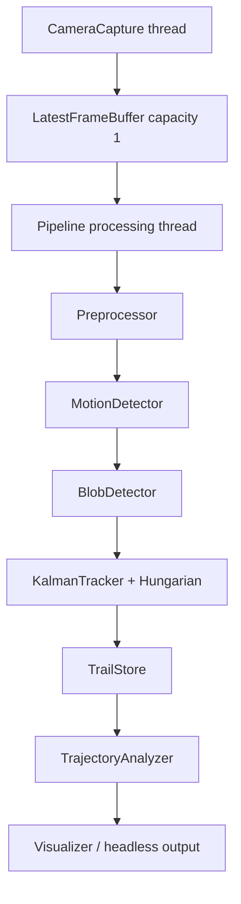
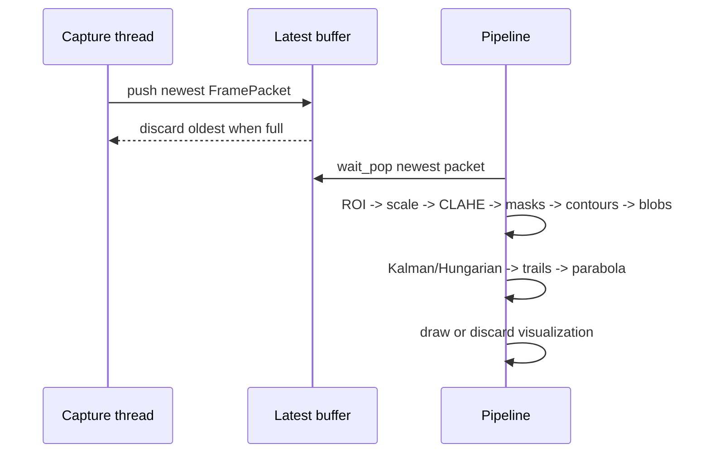

# C++ Live Architecture

## Components

`types.hpp` contains explicit ownership-neutral value types: `Detection`, `Track`, `TrailPoint`, `ArcResult`, and `FramePacket`. OpenCV `cv::Mat` uses reference-counted ownership; the capture thread transfers each packet into the buffer and the processing thread owns the consumed packet.

## Execution and frame lifecycle

The camera thread is bounded by one retained frame. `wait_pop` drains any stale packet before processing, so latency does not grow without bound. Shutdown closes the buffer, sets the stop flag, joins the camera thread, and releases `VideoCapture` through RAII.

## Threading and errors

Only the capture thread calls `VideoCapture`; only the processing thread mutates detector, tracker, trail, and trajectory state. The mutex and condition variable protect the buffer. Camera open/read failures return a nonzero result or close the buffer with a diagnostic. Configuration is parsed from an INI file and validated before pipeline construction.

## Algorithm mapping

The processing order is CLAHE grayscale, elliptical white/black top-hat, two-interval frame difference, MOG2, `tophat AND (frame_diff OR MOG2)`, 2x2 open/close, external contours, area/aspect/circularity/solidity filters, isolation rejection, constant-velocity Kalman filters, Hungarian assignment, trails, and parabola fitting. Coordinates are restored from processing scale before trails and rendering.

## Performance instrumentation

The shutdown report includes captured frames, processed frames, dropped frames, and processing FPS. Capture FPS and end-to-end latency are not claimed until measured on hardware; the packet timestamp is available for adding that measurement without changing detection APIs.

## Directory layout

- `include/projectile`: public interfaces and data types
- `src`: implementation and executable entry point
- `tests`: deterministic module tests
- `config`: external runtime configuration
- `README.md`: build/run/limitations
- `MIGRATION_MAP.md`: Python-to-C++ behavioral mapping
